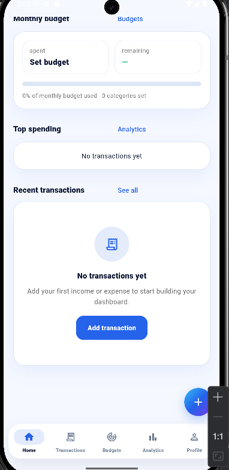
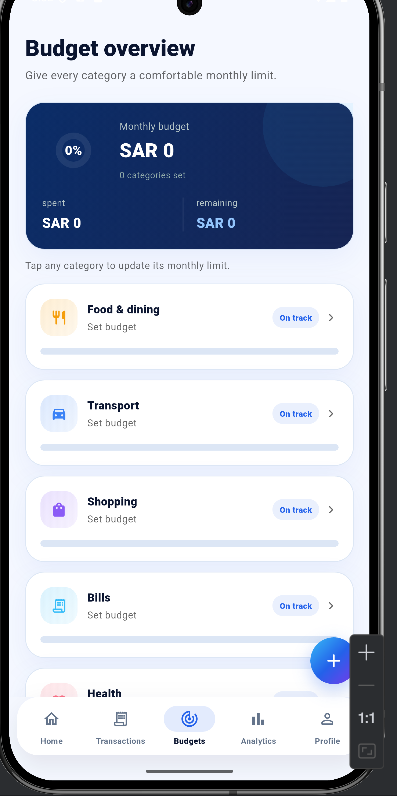
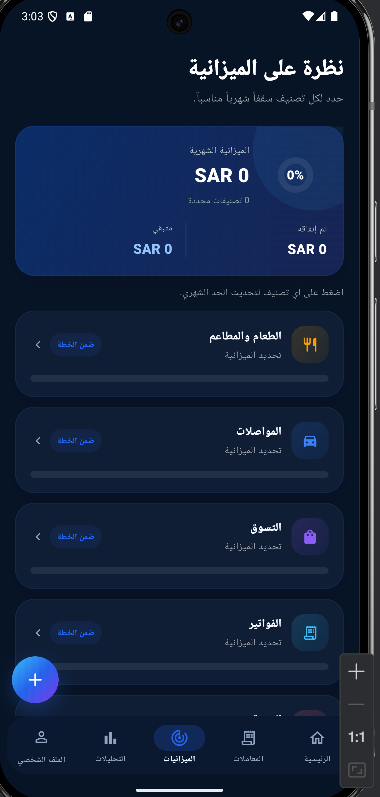
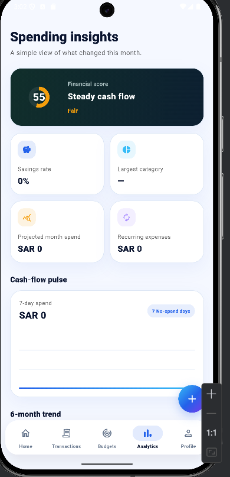
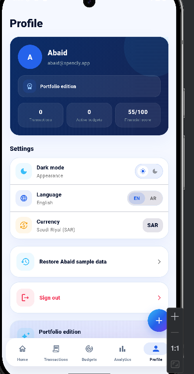
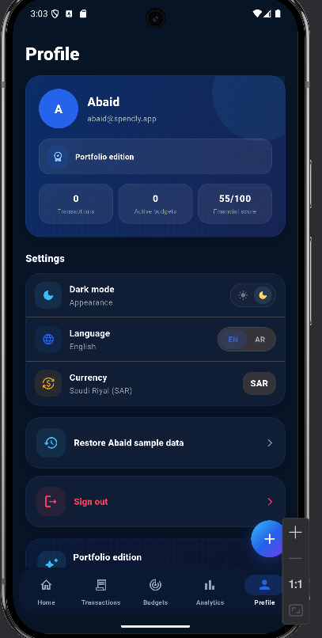
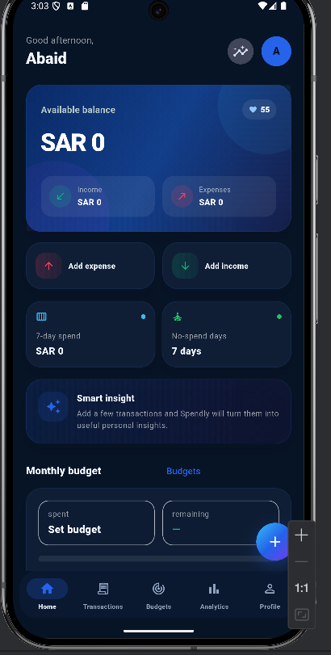

# Spendly — Personal Finance & Budget Tracker

<p align="center">
  <strong>A polished, bilingual, local-first personal finance application built with Flutter.</strong>
</p>

<p align="center">
  Track income and expenses, manage category budgets, understand spending patterns, and view financial insights with a premium blue-first fintech UI, English/Arabic support, RTL layouts, light/dark themes, and offline persistence.
</p>

<p align="center">
  <a href="https://github.com/malikabaid7373-netizen/spendly-flutter"><strong>GitHub Repository</strong></a>
</p>

---

## Overview

**Spendly** is a Flutter personal finance and budget tracking application created as a production-style mobile portfolio project.

It combines a premium blue fintech design with real application logic, local persistence, state management, analytics, responsive layouts, and bilingual user experiences.

Spendly is intentionally **local-first**. Transactions, budgets, profile preferences, theme settings, and language settings are stored on the device. No banking credentials or real financial accounts are connected.

---

## Key Features

- Income and expense tracking
- Add, edit, and delete transactions
- Category-based monthly budgets
- Monthly budget progress and remaining balance
- Search and transaction filters
- Recurring transaction support
- Available balance and monthly summary
- 7-day spending metrics
- No-spend day tracking
- Financial health score
- Smart spending insights
- Category spending analytics
- Multi-month trend charts
- Premium blue-first fintech design system
- Light and dark themes
- English and Arabic
- Full RTL/LTR layout support
- Local SQLite persistence
- Persistent profile, language, theme, onboarding, and session settings
- Responsive mobile layouts
- Animated splash, onboarding, and UI transitions
- Android release APK support

---

## Screenshots

### Dashboard — Light Mode

<p align="center">
  
  &nbsp;&nbsp;&nbsp;
  
</p>

### Transactions

<p align="center">
  
</p>

### Budgets

<p align="center">
  
  &nbsp;&nbsp;&nbsp;
  
</p>

### Analytics

<p align="center">
  
</p>

### Profile & Settings

<p align="center">
  
  &nbsp;&nbsp;
  
</p>

### Dashboard — Dark Mode

<p align="center">
  
</p>

---

## Design System

Spendly uses a blue-first fintech palette while keeping semantic colors meaningful:

```text
Brand / Navigation   → Royal Blue / Electric Blue
Secondary Accent     → Cyan
Depth Accent         → Violet
Income / Positive    → Emerald Green
Expense / Danger     → Coral / Red
Warning              → Amber
Dark Theme           → Deep Navy
Light Theme          → Soft Blue-Tinted Neutral
```

This keeps the product visually distinctive while preserving familiar financial color conventions.

---

## Tech Stack

| Area | Technology |
|---|---|
| Mobile framework | Flutter |
| Language | Dart |
| State management | Provider / ChangeNotifier |
| Navigation | go_router |
| Local database | SQLite via sqflite |
| Local settings | shared_preferences |
| Charts | fl_chart |
| Localization | English + Arabic localization |
| Date / number formatting | intl |
| Supported project structure | Android / iOS |

---

## Architecture

Spendly separates presentation, state, data access, and local persistence responsibilities.

```text
lib/
├── core/
│   ├── formatters/
│   ├── i18n/
│   ├── models/
│   ├── routing/
│   └── theme/
├── data/
│   ├── models/
│   ├── repositories/
│   └── services/
├── features/
│   ├── analytics/
│   ├── auth/
│   ├── budgets/
│   ├── home/
│   ├── onboarding/
│   ├── profile/
│   ├── shell/
│   ├── splash/
│   └── transactions/
├── view_models/
└── widgets/
```

### Data Flow

```text
Flutter UI
   ↓
ViewModels
   ↓
Repositories
   ↓
Local Services
   ↓
SQLite / SharedPreferences
```

The UI is kept separate from persistence details so a remote REST API can be introduced later without rebuilding the entire presentation layer.

---

## Local-First Design

Spendly does **not** connect to a real bank and does not currently require a remote backend.

- Transactions and budgets are stored in SQLite.
- Theme, language, profile, onboarding, and local session preferences are stored on-device.
- The repository/service structure can later support remote synchronization.
- The current version focuses on Flutter mobile engineering, UI architecture, offline persistence, and analytics.

---

## Getting Started

### Requirements

- Flutter SDK
- Dart SDK
- Android Studio or VS Code
- Android emulator or physical Android device

### Install dependencies

```bash
flutter pub get
```

### Run the app

```bash
flutter run
```

### Static analysis

```bash
flutter analyze
```

### Build release APK

```bash
flutter build apk --release
```

Generated APK:

```text
build/app/outputs/flutter-apk/app-release.apk
```

---

## Portfolio Highlights

Spendly demonstrates:

- Flutter mobile application architecture
- Reusable widgets and centralized theme design
- Provider-based state management
- SQLite persistence
- Repository and service separation
- Responsive mobile UI
- Arabic RTL implementation
- Light and dark themes
- Financial charts and derived analytics
- Persistent local preferences
- Stateful tab navigation
- Performance-focused UI updates
- Android release build generation

---

## Future Improvements

Potential production extensions:

- Remote authentication
- Django / Node.js REST API
- Cloud synchronization
- Multi-device accounts
- Biometric app lock
- Push notifications for budget thresholds
- CSV / PDF export
- Multiple currencies
- Automated ViewModel and repository testing
- Cloud backup and restore

---

## Developer

**Malik Abaid**

GitHub: [malikabaid7373-netizen](https://github.com/malikabaid7373-netizen)

---

> Spendly is a portfolio project and personal finance tracker. It does not provide banking, payment processing, investment, or financial advisory services.
