# Spendly — Personal Finance & Budget Tracker

<p align="center">
  <strong>A polished, bilingual, local-first personal finance application built with Flutter.</strong>
</p>

<p align="center">
  Track income and expenses, manage category budgets, understand spending patterns, and view financial insights — with English/Arabic support, RTL layouts, light/dark themes, and offline persistence.
</p>

---

## Overview

**Spendly** is a portfolio-focused Flutter mobile application designed to demonstrate production-style mobile UI, clean architecture, local persistence, state management, analytics, responsive layouts, and bilingual user experiences.

The app is intentionally **local-first**: financial data is stored on the device instead of being sent to a remote banking or cloud backend. This keeps the project focused on Flutter/mobile engineering while still providing real application logic and persistent data.

## Key Features

- Income and expense tracking
- Add, edit, and delete transactions
- Category-based monthly budgets
- Budget progress and remaining balance
- Search and transaction filters
- Recurring transaction support
- Monthly financial overview
- 7-day spending metrics
- No-spend day tracking
- Financial health score
- Smart spending insights
- Category spending analytics
- Multi-month trend charts
- Light and dark themes
- English and Arabic
- Full RTL/LTR layout support
- Local SQLite persistence
- Persistent profile, language, theme, and session settings
- Responsive mobile layouts
- Animated splash, onboarding, and polished UI transitions
- Android release build support

## Screenshots

### Dashboard

<p align="center">
  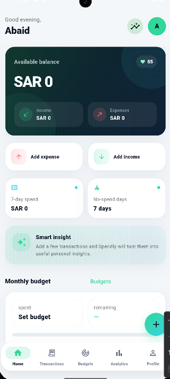
  &nbsp;&nbsp;&nbsp;
  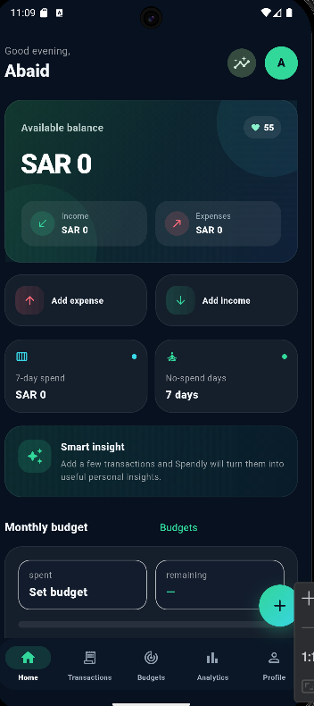
</p>

### Transactions

<p align="center">
  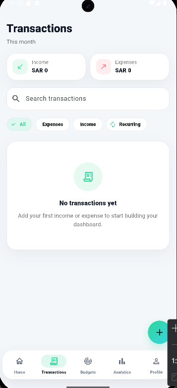
  &nbsp;&nbsp;
  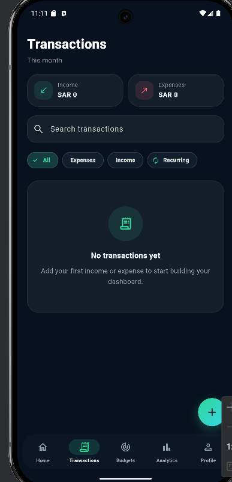
  &nbsp;&nbsp;
  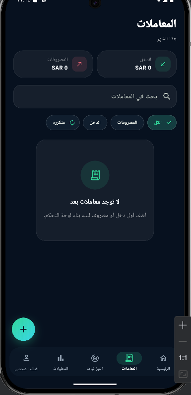
</p>

### Budgets

<p align="center">
  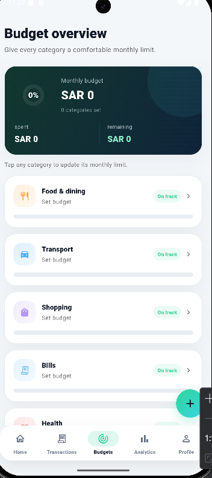
  &nbsp;&nbsp;&nbsp;
  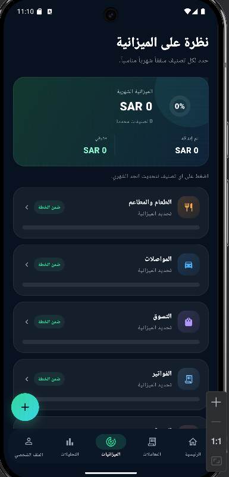
</p>

### Analytics

<p align="center">
  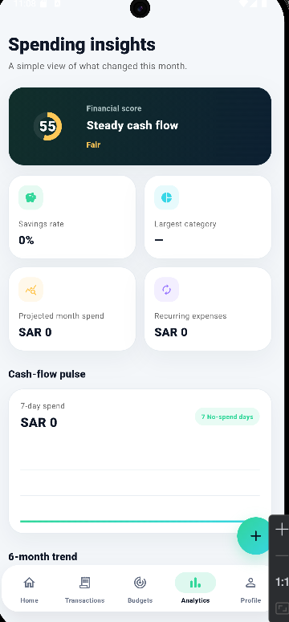
  &nbsp;&nbsp;&nbsp;
  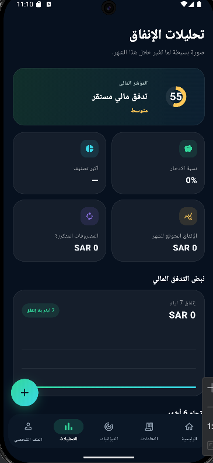
</p>

### Profile & Settings

<p align="center">
  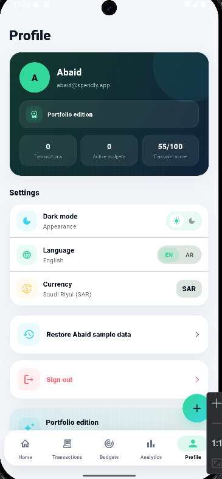
  &nbsp;&nbsp;
  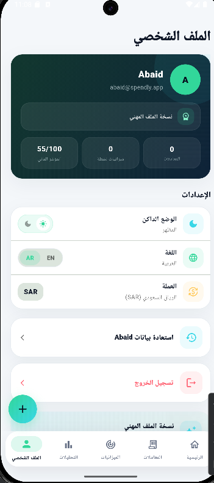
  &nbsp;&nbsp;
  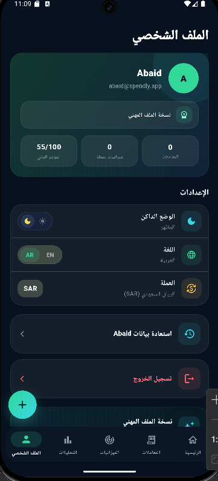
</p>

---

## Tech Stack

| Area | Technology |
|---|---|
| Mobile framework | Flutter |
| Language | Dart |
| State management | Provider / ChangeNotifier |
| Navigation | go_router |
| Local database | SQLite via sqflite |
| Local settings | shared_preferences |
| Charts | fl_chart |
| Localization | Custom English/Arabic strings + Flutter localization |
| Date/number formatting | intl |
| Platforms | Android / iOS project structure |

## Architecture

Spendly separates presentation, state, data access, and persistence responsibilities:

```text
lib/
├── core/
│   ├── formatters/
│   ├── i18n/
│   ├── models/
│   ├── routing/
│   └── theme/
├── data/
│   ├── models/
│   ├── repositories/
│   └── services/
├── features/
│   ├── analytics/
│   ├── auth/
│   ├── budgets/
│   ├── home/
│   ├── onboarding/
│   ├── profile/
│   ├── shell/
│   ├── splash/
│   └── transactions/
├── view_models/
└── widgets/
```

### Data Flow

```text
Flutter UI
   ↓
ViewModels
   ↓
Repositories
   ↓
Local Services
   ↓
SQLite / SharedPreferences
```

This structure keeps the UI independent from persistence details and makes the app easier to extend with a remote REST API later.

## Local-First Design

Spendly does **not** connect to a real bank and does not require a remote backend.

- Transactions and budgets are stored in SQLite.
- Theme, language, profile, onboarding, and session preferences are stored locally.
- The architecture can later be extended with a remote API/data source without redesigning the entire UI.

## Getting Started

### Requirements

- Flutter SDK
- Dart SDK
- Android Studio or VS Code
- Android emulator or physical Android device

### Run the project

```bash
flutter pub get
flutter run
```

### Static analysis

```bash
flutter analyze
```

### Build release APK

```bash
flutter build apk --release
```

The generated APK is available at:

```text
build/app/outputs/flutter-apk/app-release.apk
```

## Portfolio Highlights

This project demonstrates:

- Flutter application architecture
- Reusable widgets and theme systems
- Provider-based state management
- SQLite persistence
- Responsive mobile UI
- Arabic RTL implementation
- Light/dark theme support
- Charts and derived financial analytics
- Navigation and local session flows
- Release APK generation

## Future Improvements

Potential production extensions include:

- Remote authentication
- Django / Node.js REST API
- Cloud synchronization
- Multi-device accounts
- Push notifications for budget thresholds
- Biometric app lock
- Export to CSV/PDF
- Multiple currencies
- Automated tests for ViewModels and repositories

## Developer

**Abaid**

GitHub: `malikabaid7373-netizen`

---

> Spendly is a portfolio project and personal finance tracker. It does not provide banking, payment processing, investment, or financial advisory services.
